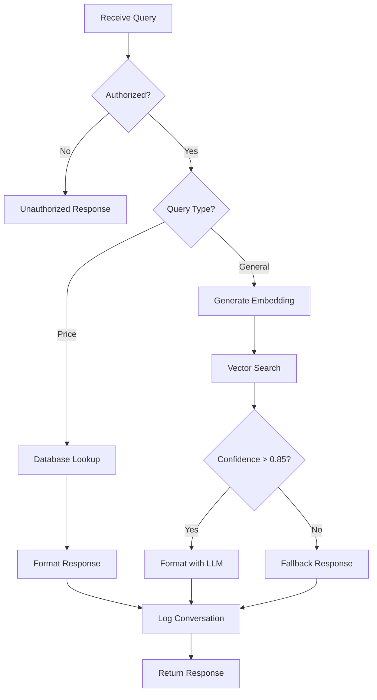

# Genium Architecture

This document describes the technical architecture of Genium, following the design specifications provided.

## System Overview

Genium is a WhatsApp-based RAG (Retrieval Augmented Generation) chatbot for real estate brokers. It provides instant, high-confidence answers about property listings using:

- **Vector search** for semantic understanding
- **Confidence-based filtering** (threshold: 0.9)
- **Deterministic routing** for price queries
- **LLM-powered** response formatting

## Architecture Diagram

```
┌─────────────────────────────────────────────────────────────────┐
│                         Genium System                            │
├─────────────────────────────────────────────────────────────────┤
│                                                                   │
│  ┌──────────────┐    ┌──────────────┐    ┌──────────────┐      │
│  │   WhatsApp   │───▶│  Evolution   │───▶│   Convex     │      │
│  │   (Broker)   │    │   API        │    │   Webhook    │      │
│  └──────────────┘    └──────────────┘    └──────┬───────┘      │
│                                                   │               │
│                                                   ▼               │
│  ┌─────────────────────────────────────────────────────────┐    │
│  │              RAG Pipeline (Convex Actions)               │    │
│  ├─────────────────────────────────────────────────────────┤    │
│  │  1. Authorization Check (Phone Number)                   │    │
│  │  2. Query Classification                                 │    │
│  │     ├─ Price Query → Deterministic Lookup               │    │
│  │     └─ General Query → Vector Search                    │    │
│  │  3. Property Retrieval                                   │    │
│  │     ├─ Database Query (Price)                           │    │
│  │     └─ Vector Similarity Search (RAG)                   │    │
│  │  4. Confidence Filtering (threshold: 0.9)               │    │
│  │  5. Response Formatting (LLM - GPT-4)                   │    │
│  │  6. Conversation Logging                                │    │
│  └─────────────────────────────────────────────────────────┘    │
│                                                   │               │
│                                                   ▼               │
│  ┌──────────────┐    ┌──────────────┐    ┌──────────────┐      │
│  │   Response   │◀───│  Evolution   │◀───│   Convex     │      │
│  │  to WhatsApp │    │   API        │    │   Response   │      │
│  └──────────────┘    └──────────────┘    └──────────────┘      │
│                                                                   │
│  ┌─────────────────────────────────────────────────────────┐    │
│  │              Admin Dashboard (Next.js)                   │    │
│  ├─────────────────────────────────────────────────────────┤    │
│  │  - Properties Management                                 │    │
│  │  - Broker Authorization                                  │    │
│  │  - Conversation Viewer                                   │    │
│  │  - Test Query Interface                                  │    │
│  └─────────────────────────────────────────────────────────┘    │
│                                                                   │
└─────────────────────────────────────────────────────────────────┘
```

## Core Components

### 1. Convex Backend (Instance 1: Schema + Seeding)

**Files:** `convex/schema.ts`, `convex/seed.ts`, `convex/brokers.ts`, `convex/properties.ts`, `convex/messages.ts`

**Responsibilities:**
- Database schema definition
- Data seeding with sample properties
- Broker authorization management
- Property CRUD operations
- Message and conversation storage

**Key Features:**
- Vector index on properties (`by_embedding` - 1536 dimensions for Ada-002)
- Indexed queries for efficient retrieval
- Real-time data synchronization

**Database Schema:**

```typescript
properties {
  projectName, unitType, bedrooms, bathrooms,
  sqft, price, floor, status, description,
  embedding[1536] // Vector for RAG
}

brokers {
  phoneNumber, name, email, authorized, createdAt
}

conversations {
  brokerId, phoneNumber, startedAt, lastMessageAt, messageCount
}

messages {
  conversationId, brokerId, direction, content,
  timestamp, queryType, confidence, propertyId
}

config {
  key, value, description
}
```

### 2. WhatsApp Integration (Instance 2: Webhook + Outbound)

**Files:** `convex/http.ts`

**Responsibilities:**
- Receive incoming WhatsApp messages via Evolution API webhook
- Process message data and extract query
- Trigger RAG pipeline
- Send responses back via Evolution API

**Webhook Flow:**
1. Evolution API sends POST to `/webhook/whatsapp`
2. Extract phone number and message text
3. Call RAG pipeline (`processQuery`)
4. Send formatted response via Evolution API

**Endpoints:**
- `POST /webhook/whatsapp` - Main WhatsApp webhook
- `POST /query` - Test endpoint (no WhatsApp required)
- `GET /test` - Health check

### 3. RAG Pipeline (Instance 3: Embedding + Similarity + Answer Composer)

**Files:** `convex/rag.ts`

**Responsibilities:**
- Generate embeddings for properties (one-time setup)
- Generate query embeddings (per request)
- Perform vector similarity search
- Classify queries (price vs. general)
- Format responses using LLM

**Query Classification:**

```javascript
classifyQuery(query) {
  if (cheapest + price keywords) {
    if (bedroom count) return "price_bedrooms"
    return "price_cheapest"
  }
  return "general"
}
```

**Processing Flow:**

```
Query → Authorization Check
  ↓
Query Classification
  ├─ Price Query → Database Lookup → Deterministic Response
  └─ General Query → Generate Embedding
      ↓
  Vector Search (top 5 results)
      ↓
  Confidence Filter (> 0.85)
      ↓
  Format with LLM (GPT-4)
      ↓
  Return Response + Log Conversation
```

**Confidence Thresholds:**
- Deterministic queries: 1.0 (100%)
- Vector search minimum: 0.85 (85%)
- User-facing threshold: 0.9 (90%)

**OpenAI Integration:**
- **Embeddings:** `text-embedding-ada-002` (1536 dimensions)
- **LLM:** `gpt-4` (temperature: 0.3, max_tokens: 100)

### 4. Admin Dashboard (Next.js Frontend)

**Files:** `app/page.tsx`, `components/*.tsx`, `lib/convex.tsx`

**Responsibilities:**
- Visualize properties, brokers, and conversations
- Manage broker authorization
- Test queries without WhatsApp
- Monitor system activity

**Tabs:**
1. **Properties Tab**
   - View all properties
   - Seed database
   - Generate embeddings
   - Property statistics

2. **Brokers Tab**
   - View all brokers
   - Add/remove brokers
   - Toggle authorization
   - Broker statistics

3. **Conversations Tab**
   - View all conversations
   - Message history
   - Query types and confidence scores
   - Timeline view

4. **Test Query Tab**
   - Send test queries
   - View responses
   - Debug confidence scores
   - Sample queries

## Data Flow

### Inbound Message Flow

```
WhatsApp → Evolution API → Convex Webhook → RAG Pipeline → Response → Evolution API → WhatsApp
```

### Query Processing Flow



## Key Design Decisions

### 1. Deterministic Price Routing

**Rationale:** Price queries like "cheapest unit" have objective answers. Using RAG would add unnecessary latency and potential for hallucination.

**Implementation:**
- Regex pattern matching for price keywords
- Direct database query with sorting
- 100% confidence score

### 2. Confidence Threshold (0.9)

**Rationale:** Real estate decisions involve significant financial commitment. High confidence threshold ensures accuracy over availability.

**Fallback:** When confidence < 0.9, system asks for clarification rather than providing potentially incorrect information.

### 3. Single LLM Call

**Rationale:** Minimize latency and API costs while maintaining response quality.

**Implementation:**
- LLM only used for final formatting
- System prompt ensures concise, one-line responses
- Temperature: 0.3 (balance between consistency and naturalness)

### 4. Phone Number Authorization

**Rationale:** Simple, secure, and WhatsApp-native authentication method.

**Implementation:**
- Phone numbers stored in `+1234567890` format
- Checked against `brokers` table before processing
- Easy to manage via admin dashboard

## Scalability Considerations

### Current Architecture
- Suitable for: 1 project, ~10-50 properties, <100 brokers
- Expected response time: < 2 seconds
- Vector search: Linear scan (acceptable for small dataset)

### Scaling Path
1. **More Properties (100+):**
   - Convex vector search already indexed
   - No changes needed

2. **Multiple Projects (10+):**
   - Add project filtering to vector search
   - Broker-to-project assignment table

3. **High Volume (1000+ messages/day):**
   - Convex scales automatically
   - Consider caching frequent queries
   - Batch embedding generation

4. **Multiple Languages:**
   - Multilingual embeddings (e.g., `text-embedding-3-large`)
   - Language detection in query router

## Security

### Authentication
- Broker authorization via phone number whitelist
- No public endpoints (webhook only)

### Data Protection
- Environment variables for API keys
- Convex handles encryption at rest
- No PII stored beyond phone numbers

### API Key Management
- OpenAI API key in Convex environment
- Evolution API key in Convex environment
- Keys never exposed to frontend

## Monitoring & Debugging

### Logs
- Convex logs: `npx convex logs`
- Message history in dashboard
- Confidence scores tracked per message

### Metrics
- Total conversations
- Messages per broker
- Query type distribution
- Average confidence scores

### Testing
- Test Query tab for manual testing
- Sample queries provided
- No WhatsApp required for testing

## Deployment

### Development
```bash
# Terminal 1
npx convex dev

# Terminal 2
npm run dev
```

### Production
```bash
# Deploy Convex
npx convex deploy

# Deploy Next.js (Vercel)
vercel deploy
```

### Environment Variables
- **Frontend:** `NEXT_PUBLIC_CONVEX_URL`
- **Backend:** `OPENAI_API_KEY`, `EVOLUTION_API_URL`, `EVOLUTION_API_KEY`

## Future Enhancements

### Phase 2 (Potential)
- [ ] Multi-project support
- [ ] Image generation for property visuals
- [ ] Voice message support
- [ ] Appointment scheduling
- [ ] CRM integration

### Phase 3 (Advanced)
- [ ] Predictive pricing recommendations
- [ ] Broker performance analytics
- [ ] Multi-language support
- [ ] Mobile app

## References

- [Convex Documentation](https://docs.convex.dev)
- [OpenAI Embeddings](https://platform.openai.com/docs/guides/embeddings)
- [Evolution API](https://doc.evolution-api.com)
- [Next.js Documentation](https://nextjs.org/docs)

---

**Architecture Version:** 1.0  
**Last Updated:** October 2025  
**Implementation:** Claude Code (3 parallel instances)

